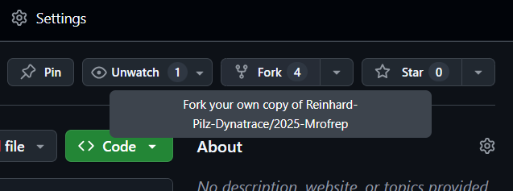
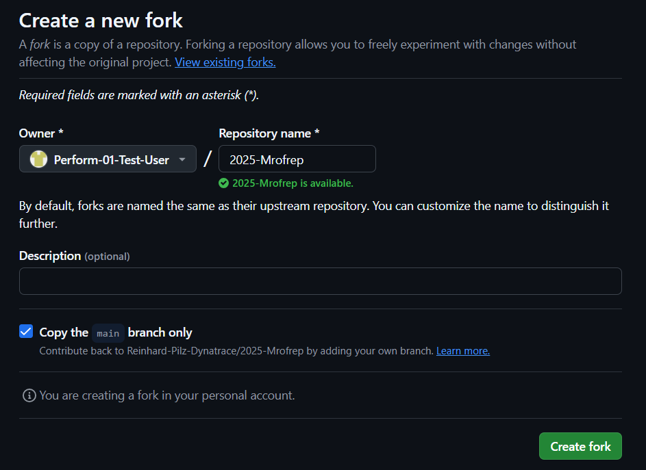

## Fork the GitHub Repository

The demo application of todays session is located on [GitHub](https://github.com/Reinhard-Pilz-Dynatrace/2025-Mrofrep).

> Note: update link after dry run

You will need to fork that repository to your own GitHub Account in order to launch it.

> Note: update images after dry run
