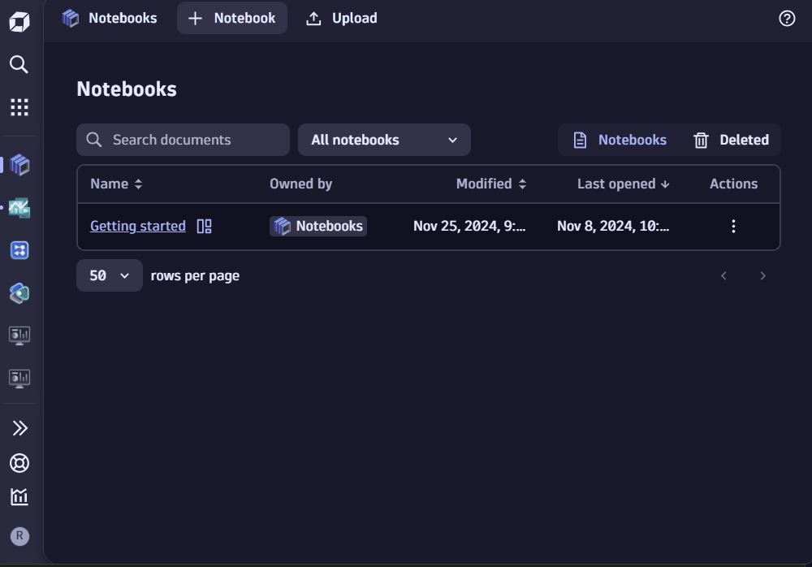
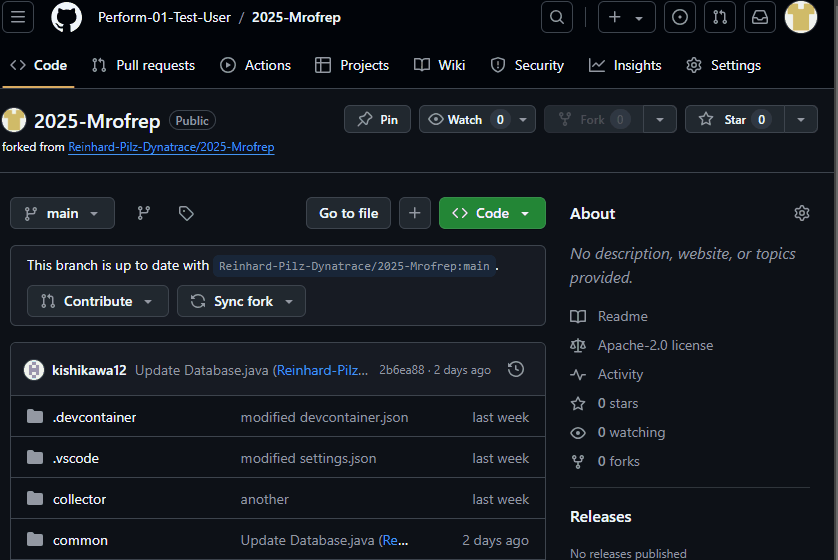

## Configure Credentials

You will be launching the demo app using GitHub Code Spaces.
Before we are able to do that, we need to configure two secrets in your GitHub account. They will let the app know where to report monitoring data to and how to authenticate.

### 📌 Create Dynatrace API Token

📝 **Reference:**
- [How to create Access Token](https://docs.dynatrace.com/docs/manage/access-control/access-tokens#create-api-token)
- [Token scopes](https://docs.dynatrace.com/docs/shortlink/otel-getstarted-otlpexport#authentication-export-to-activegate)

Select the following token scopes
- logs.ingest
- metrics.ingest
- openTelemetryTrace.ingest
- InstallerDownload

### 📌 Create Code Space Secrets

Within your GitHub Repository navigate to `Settings` and in there to `Secrets and variables` / `Codespaces`.
In here you need to define two secrets:
* `DT_ENVIRONMENT_URL` needs to contain the URL of the Dynatrace environment for todays session (`https://xyz.live.dynatrace.com` or `https://xyz.apps.dynatrace.com` will work)
* `DT_API_TOKEN` needs to contain the API Token you have created earlier.
 
 

> 📝 **Note**: Currently, Dynatrace API calls are only accessible via *.<mark>***live***</mark>.dynatrace.com domain. To simplify this hands on, we programed our lab to be able to accept other formats for `DT_ENVIRONMENT_URL` and translate them to the necessary format. Outside of this lab, please do ***NOT*** use https://xyz.apps.dynatrace.com, take note that only *.<mark>***live***</mark>.dynatrace.com domain will work.

