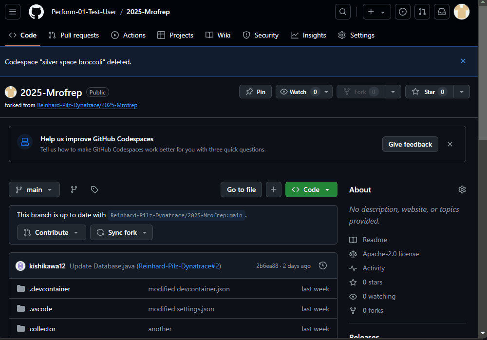

## Launch Codespaces

- In your GitHub Repo click on the green `Code` button
- Select the `Codespaces` tab
- Click on `Create codespace on main`

 
GitHub needs about two minutes to provision hour code space.

Once you can see the folder structure on the left and a terminal is available, you are ready to move on.
