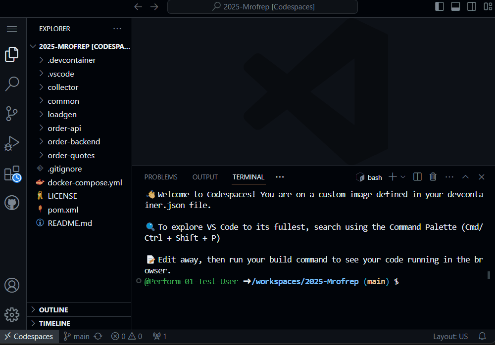

## How to start/stop the Demo Application

Executing
```
docker compose up -d --build
```
will launch several Docker containers.

<center>

</center>
<br />

The first time you're executing that command several docker images are required to get pulled from Docker Hub. It will take about a minute until everything is up and running.

Later on, during our Hands On tasks, you will have to make a couple of modifications to the source code and configuration of the demo app. You can relaunch the demo app with modifications by executing

```
docker compose up -d --build
```
yet again. Docker will make sure your containers will get shut down and relaunched.
