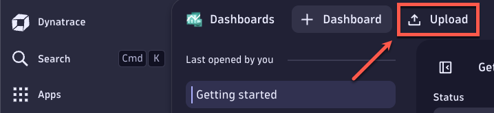
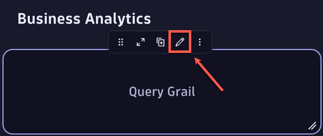
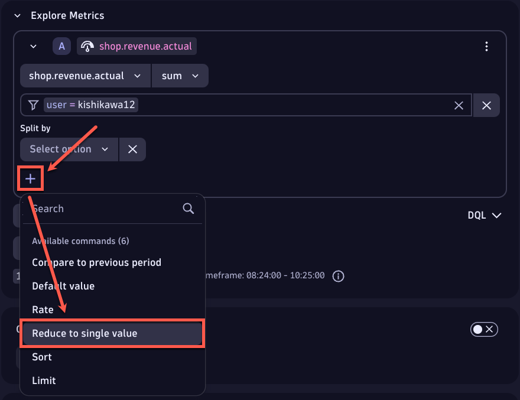
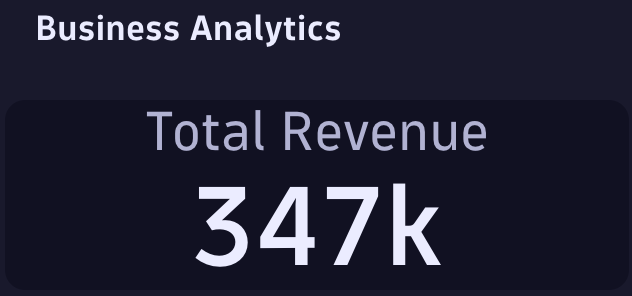

## Enhance the existing OpenTelemetry metric definitions

In this section, we will enhance the existing OpenTelemetry metric definitions by adding an additional attribute.


### 📌 Task #1: Enhance the existing metrics

**Your Task:** Enhance the existing metrics by adding an additional attribute

In the file `src/main/shop/FrontendServer.java`, the functions `reportPurchases` and `reportExpectedRevenue` have been updated to include an attribute with the key `user` and the value `System.getenv("GITHUB_USER")`, allowing metrics to be tied to individual attendee instances. Please update the `reportActualRevenue` function to include the same attribute.

<details>
  <summary>Solution: Expand to copy and paste the code</summary>

  ```java
private static void reportActualRevenue(Product product) {
	Attributes attributes = Attributes.builder()
    .put(AttributeKey.stringKey("product"), product.getName())
    .put(AttributeKey.stringKey("user"), System.getenv("GITHUB_USER"))
    .build();
		
	actualRevenueCounter.add(product.getPrice(), attributes);		
}
  ```
</details>

After making the changes above, restart your application by running `docker compose up -d --build` in the terminal.


#### 📌 Task #2: Upload `Shop Application Overview` dashboard

Download the following JSON to your local machine so that you can upload it later.

[Shop Application Overview.json]([http](https://github.com/Reinhard-Pilz-Dynatrace/2025-Mrofrep/blob/main/Shop%20Application%20Overview.json))

> NOTE: update this after the dry run

Then upload the dashboard to your tenant - navigate to `Apps`, open the `Dashboards` app, and select `Upload`.




### 📌 Task #3: Chart a metric

**Your Task:** Configure a total revenue tile

1. Click on the first empty tile (top left) under `Business Analytics`, then the pencil icon to edit the tile.



2. Navigate to the `Select metric` dropdown, search for `shop.revenue.actual` and select the metric.
3. Change the `avg` aggregation dropdown to `sum`.
4. Click on `Type to filter` and set the filter `user = <your-github-username>`.
    Hint: To complete the step, click outside of the filter dropdown.
5. Click on `Run` and verify the metric is being captured by Dynatrace by viewing the chart.
6. In order to use a single value tile, click on the `+` under the `Split by` and select `Reduce to single value`.



7. Under the `Reduce to single value` dropdown, select `Sum`. 
8. Click on `Run` again.
9. Navigate to the `Visual` tab, and select `Single value` for visualization.
10. Expand the `Single value` configuration category:
	* Edit `Label` to `Total Revenue`
11. Disable the `Trend` and `Sparkline` by toggling the slider.
12. Close out of the edit window of the tile.

<details>
  <summary>Results:</summary>
  
</details>


### 📌 (Optional) Challenger Task

**Your Task:** Modify all of the populated tiles under `Business Analytics` by adding a filter on the new `user` attribute/dimension.

---
