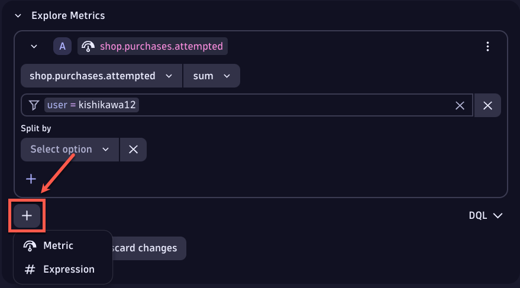
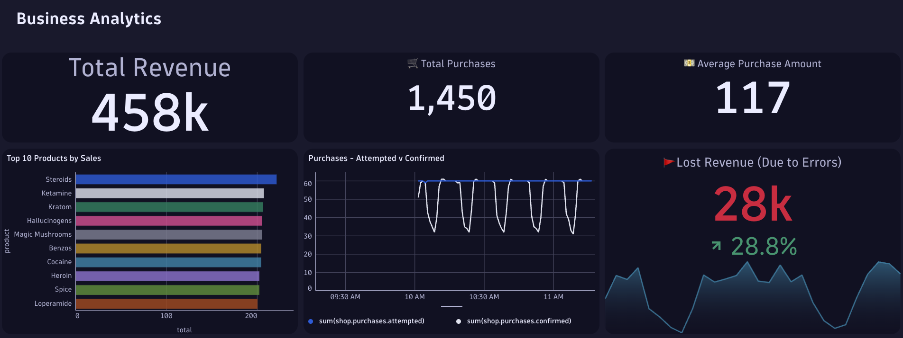

## Create new OpenTelemetry metric definition

In this section, we will create a new OpenTelemetry instrument and setup the logic to pass a measurement. 


References: Dynatrace documentation
- [Dynatrace OpenTelemetry Metrics](https://docs.dynatrace.com/docs/shortlink/opentelemetry-extend-metrics)
- [Best practices for OpenTelemetry metrics](https://docs.dynatrace.com/docs/shortlink/opentelemetry-best-practices-metrics)
- [Java: Supported libraries, frameworks, application servers, and JVMs](https://github.com/open-telemetry/opentelemetry-java-instrumentation/blob/main/docs/supported-libraries.md#supported-libraries-frameworks-application-servers-and-jvms)


### 📌 Task #1: Create an additional instrument

**Your Task:** Create an additional LongCounter to track attempted purchases

In the file `src/main/shop/FrontendServer.java`, create a new LongCounter object called `attemptedPurchasesCounter` near line 43. The object should have the following properties:
- name:`shop.purchases.attempted`
- description:`Attempted number of purchases`

Hint: This will be similar to the LongCounter objects `confirmedPurchasesCounter`, `expectedRevenueCounter`, and `actualRevenueCounter`.

<details>
  <summary>Solution: Expand to copy and paste the code</summary>

  ```java
private static final LongCounter attemptedPurchasesCounter = meter.counterBuilder("shop.purchases.attempted").setDescription("Attempted number of purchases").build();
  ```
</details>


### 📌 Task #2: Create a function to pass a measurement 

**Your Task:** Create a function that will pass a measurement to your instrument 

In the file `src/main/shop/FrontendServer.java`, create a new function called `reportAttemptedPurchases` after the existing functions. The function should take `product` as a parameter and increment the `instrument` tracking attemptedPurchases by 1.

Hint: This will be similar to the `reportPurchases` function near line 135. 

<details>
  <summary>Solution: Expand to copy and paste the code</summary>

  ```java
	private static void reportAttemptedPurchases(Product product) {
		Attributes attributes = Attributes.builder()
        .put(AttributeKey.stringKey("product"), product.getName())
		.put(AttributeKey.stringKey("user"), System.getenv("GITHUB_USER"))
        .build();

		attemptedPurchasesCounter.add(1, attributes);
	}
  ```
</details>


### 📌 Task #3: Call the function 

**Your Task:** Add a call to the function passing the measurement

In the `handlePlaceOrder` function under the call `reportExpectedRevenue(product);`, invoke the `reportAttemptedPurchases` function passing `product` as an argument.

Hint: This will be similar to the `reportExpectedRevenue` function invocation. 

<details>
  <summary>Solution: Expand to copy and paste the code</summary>

```java
reportAttemptedPurchases(product);
```
Seen inline:
  ```diff
	public static String handlePlaceOrder(HttpExchange exchange) throws Exception {
		// log.info("Placing order");
		Product product = Product.random();
		String productID = product.getID();
		reportExpectedRevenue(product);
+	reportAttemptedPurchases(product);
		try (Connection con = Database.getConnection(10, TimeUnit.SECONDS)) {
			try (Statement stmt = con.createStatement()) {
				stmt.executeUpdate("INSERT INTO orders VALUES (" + productID + ")");
			}
		}
		validateCreditCard(product);
		return checkInventory(product);
	}
  ```
</details>

After making the changes above, restart your application by running `docker compose up -d --build` in the terminal.


### 📌 Task #4: Chart a metric

**Your Task:** Configure a purchases attempted vs confirmed chart

1. Click on the last empty tile (bottom center) under `Business Analytics`, then the pencil icon to edit the tile.
2. Start by naming the tile to `Purchases - Attempted v Confirmed` at the top of the right pane.
3. Navigate to the `Select metric` dropdown, search for `shop.purchases.attempted` and select the metric.
4. Change the `avg` aggregation dropdown to `sum`.
5. Click on `Type to filter` and set the filter `user = <your-github-username>`.
    Hint: To complete the step, click outside of the filter dropdown.
6. Click on the gray `+` above `Run`, and then select `Metric` to add a second metric.



7. Navigate to the `Select metric` dropdown for the second metric, search for `shop.purchases.confirmed` and select the metric.
8. Change the `avg` aggregation dropdown to `sum` for the second metric.
9. Click on `Type to filter` and set the filter `user = <your-github-username>` for the second metric.
10. Click on `Run` and verify the metrics are being captured by Dynatrace by viewing the chart.
11. Close out of the edit window of the tile.

<details>
  <summary>Results:</summary>

</details>

### 📌 (Optional) Challenger Task

**Your Task:** Create a new OpenTelemetry metric and chart it on the dashboard.

---
