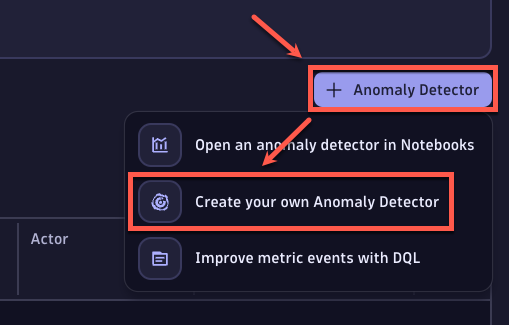
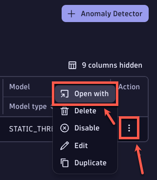
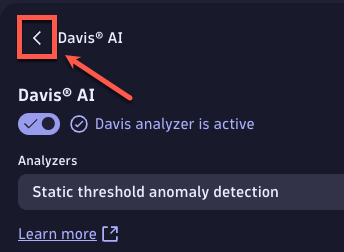
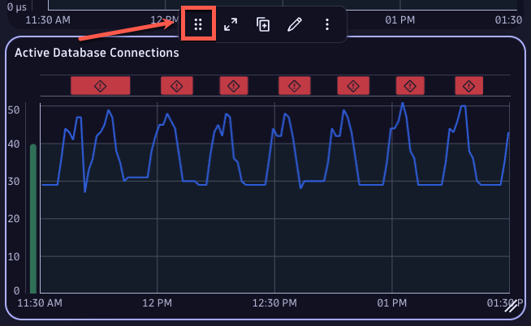
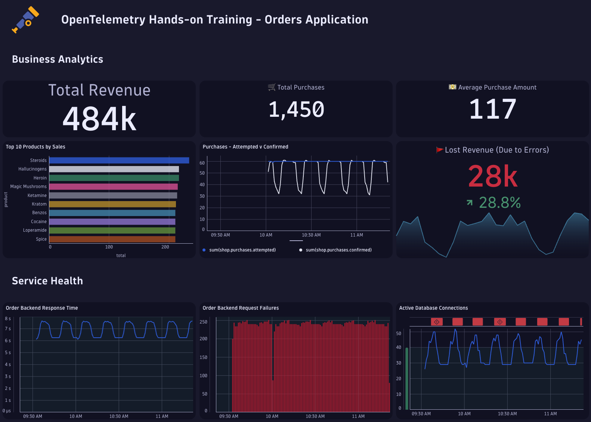

## Davis Anomaly Detection (Alerting)

In this section, we will create a Davis anomaly detector against one of our captured OpenTelemetry metrics.


### 📌 Task #1: Create a Davis anomaly detector

Lets create a Davis anomaly detector based off of the `shop.database.connections.active` metric. 

1. Navigate to the `Davis Anomaly Detection` app. 
2. Create a new detector by clicking on `+ Anomaly Detector`, then `Create your own Anomaly Detector`.



3. Under `Get started`, set the title to `Shop: Connections Active`.
4. Expand the `Configure your query` category. Copy/Paste the following DQL under `Query` and replace the filter with your GitHub username.
```
timeseries avg(shop.database.connections.active), filter:{matchesValue(entityAttr(dt.entity.service, "entity.name"), "order-backend-<your-github-username>")}
```
5. Expand the `Customize parameters` category, and set the following configuration.
| Field | Value |
| ------ | ------------- |
| Analyzers | `Static threshold anomaly detection`  |
| Threshold | `40` |
| Alert condition | `Alert if metric is above` | 

6. Lastly, expand the `Create an event template` category and set the `Event name` to `High Active Database Connections`.
7. Finish creating the anomaly detector by selecting `Create`.


### 📌 Task #2: Chart the Davis anomaly detector

**Your Task:** Configure the active database connections anomaly detector as a tile in our dashboard.

1. In the `Davis Anomaly Detection` app, find the `Shop: Connections Active` detector that was created in the previous step.
2. Under the `Action` header on the far right of the table, select the three dots for our detector then navigate to `Open with`.



3. In the `Open with` window, select `Dashboards`.
4. Under the `Select destination` window, select your dashboard `OTel HOT - Perform 2025`, then `Confirm`.
5. At this point, you should be back in your dashboard with the new tile edit window in the right pane. Back out of the Davis AI menu by clicking on the left arrow.



6. Set the name of the tile to `Active Database Connections`.
7. Navigate to the `Visual` tab, and expand the `Davis AI analysis chart` category.
8. Set the `Visible sections` to `Chart`.
9. Close out of the edit window of the tile.
10. Move the tile to the right of `Order Backend Request Failures` by click/holding the six dots above the `Active Database Connections` tile.



<details>
  <summary>Final Results:</summary>

</details>
