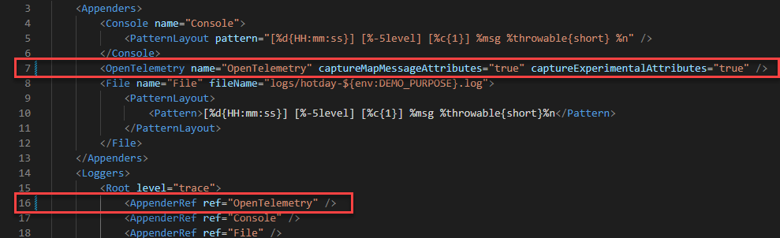

## Ingesting logs via OpenTelemetry

📝 **Reference:** Dynatrace documentation [OpenTelemetry Logs](https://docs.dynatrace.com/docs/shortlink/otel-overview-logs)

### 📌 Task

**Task 1:** Enable Java environment variables for the Backend server Java Otel logs exporter. File name is <mark>**Dockerfile**</mark>

The file can be found in
```
order-backend/Dockerfile
```
1. Remove the comments on lines `48` and `49`.
1. Rebuild the containers by running `docker compose up -d --build`

The final <mark>Dockerfile</mark> should look like this.

```bash
ENV OTEL_LOGS_EXPORTER=otlp
ENV OTEL_EXPORTER_OTLP_LOGS_PROTOCOL=http/protobuf
```

**Optional:** Enable log appenders in <mark>**log4j2.xml**</mark>

The file can be found in
```
src/main/resources/log4j2.xml
```

The configuration for log4j is goverened in the xml resource file. This is useful when using manual instrumentation and it can help insert the traceid and spanid without much programming effort for those Java codes where manual insturmentation is done.

This step here is optional because we are using the auto instrumentation on this Java service and many items are taken care by the auto instrumentation agent.

1. Remove the comments on line 7.
1. Remove the comments on line 16.

The final <mark>**log4j2.xml**</mark> should look like this.



In case the log4j file is messed up, here is the working code that you can copy. 

<details>
  <summary>Expand to copy the contents</summary>

```xml
<?xml version="1.0" encoding="UTF-8"?>
<Configuration packages="io.opentelemetry.instrumentation.log4j.appender.v2_17">
    <Appenders>
        <Console name="Console">
            <PatternLayout pattern="[%d{HH:mm:ss}] [%-5level] [%c{1}] %msg %throwable{short} %n" />
        </Console>
        <OpenTelemetry name="OpenTelemetry" captureMapMessageAttributes="true" captureExperimentalAttributes="true" />
        <File name="File" fileName="logs/hotday-${env:DEMO_PURPOSE}.log">
            <PatternLayout>
                <Pattern>[%d{HH:mm:ss}] [%-5level] [%c{1}] %msg %throwable{short}%n</Pattern>
            </PatternLayout>
        </File>
    </Appenders>
    <Loggers>
        <Root level="trace">
            <AppenderRef ref="OpenTelemetry" />
            <AppenderRef ref="Console" />
            <AppenderRef ref="File" />
        </Root>
    </Loggers>
</Configuration>
```

</details>

### ✅ Verify Results

You should start receiving logs in Dynatrace.
- Navigate to **Dynatrace menu > logs**
- The log viewer should start populating with logs
